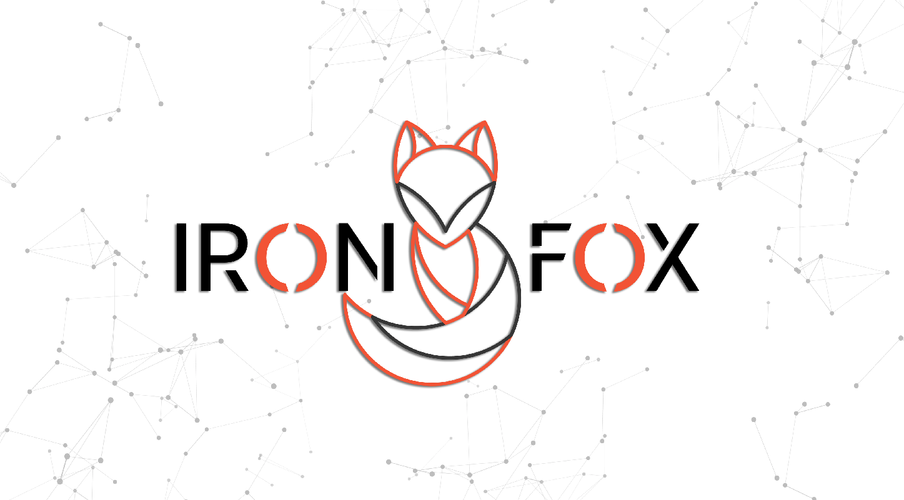

                                REAL-TIME BOT PROTECTION CHALLENGE
IronFox
==================

Sponsored by: ***Safe Instrument*** (https://safeinst.com/) 

IronFox is a real-time and high performance bot protection, that using Nginx as a reverse proxy. 
With a stateless approach for request processing, simple architect and anomaly detection it is possible 
for IronFox to handle millions session/second in distributed mode with zero latency.

- Core
    - [x] Anomaly Detection
        - [x] server side analyzing
        - [x] client side browser fingerprinting
    - [ ] AI based protection
         - [ ] detection based on Neutral Networks
        - [ ] enhancement and detection score based on Fuzzy Logic 
- Management
    - [x] basic web dashboard 
    - [ ] enhancement 
- Documents
    - [x] Wiki
    
    
release:  0.1.0 

### Setup and configuration

    the latest version of IronFox has been successfully tested on Ubuntu Server 20.04.3 LTS

run ./install.sh with root privilege, the install process automatically download and install all dependencies and services in your machine
     
### Introduction

With technology development and complexity of cyberattack strategies, the traditional technologies and current security methods are not able to perform all lines of 
defence in preventing cyberattacks. 
The first-generation firewalls and intrusion detection systems (IDS) used to meet the security requirements of all kinds of businesses.
The second generation of security products and solutions including Web Application Firewalls (WAF) also have played an acceptable role in cyberspace for a while.

Securing e-commerce, web applications and mobile applications are crucial and even though the second and third generation of security techniques (IDS, IDP, NGF) have 
been developed, bot and botnet attacks such as Denial of Service (DoS) attacks and Distributed Denial of Service (DDoS) attacks are still concerning as challenges in 
cyberspace and online businesses security. 

According to published reports, botnet attacks or more generally botnet exploitation have caused irreparable damages for e-commerce and information exchange spaces. 
The new generation of bots is intelligent attacks which their detection and identification are of great importance and complication.
Various solutions and articles have been proposed and published to confront bots and botnets. For instance, tracking the master (source of attacks) 
and deactivating the slaves (bots) are two proposed methodologies when tackling DoS and DDoS attacks. 

Nonetheless, these methods are laborious or in most cases almost 
impossible to perform.IronFox is a high-performance bot protection with sagacity in identifying and blocking the bots existing in layers of web applications (7th layer), 
and capability of using new approaches to employ operational services and executive environments in an in-line form. This article is going to have a look at the content of bots, 
their structure and attack and introduce the suggested solutions to oppose them.

### What Is a Bot?
A bot is a software application that is designed to fulfil various purposes and perform different tasks. For example, crawler ( as a bots) help search engines to
browse the web and index information from websites. Bots can be both legitimate, such as search engines crawler (e.g., Google), and malicious, like the crawlers
which exploit broken authentication or access control of a weak web application or an online service. 
These malicious crawlers steal data from the server and make
server source and services inaccessible by generating web traffic and putting pressure on the server. They also have many other nefarious capabilities, such as 
automatic testing and exploiting one vulnerability for a thousand destinations. 

Depending on its goal, a bot’s structure could be simple or complicated and intelligent.
Currently, business development has left no choice but to accept bot prevalence and to find solutions for their recognition and classification. For example, search engine 
crawlers cannot be excluded from indexing websites, using techniques such as Captcha. On the other hand, permitting destructive bots to remain active may lead to a severe 
decline in the quality of online services and possibly render those services inaccessible for users. Therefore, to prevent and block corrupt attacks, solutions must be 
proposed to recognize and segregate harmless and malicious bots.

### Bots and Botnet Attacks
Bots run and execute large-scale attacks, such as:

    1- Scanning vulnerability and performing malicious codes to exploit vulnerable services (e.g., WordPress vulnerable module).
    2- Crawling and theft of data: bots automatically crawl and steal data much faster than a human user.
    3- Generating demands and launching Denial of Service (DoS) attacks: by performing DoS and Distributed Denial of Service (DDoS) attacks, botnets can waste a server’s resources, services and make them unreachable for users. For instance, making traffic or fake requests by bots can easily slow the process down in trading systems, which depend greatly on time, until they become completely unavailable for the legitimate human users.
    4- Cheating: for example, in online polls, or similar systems, bots can act as a genuine user and automatically go through the entire process, from registration to voting. To design and develop such bots, having access to libraries or frameworks - such as Selenium – and writing a few lines of codes would be adequate.
    5- Identity theft and faking: bots can simply operate as a real person and create fake identities. 
    6- Performing repetitive patterns: bots can be automated to run repetitive scripts continuously. They can easily abuse the API used by a standard mobile application.
    7- and sort of attacks are considerible.
Beyond this list, there are many other operations that bots can execute.

### Structure of Bots
In general, (Application Layer) bots can be divided into four groups:

    * First-generation bots: these bots have fairly easy structures and they can run simple automatic patterns. They don’t have any understanding of the web’s basic contents like Cookies and Sessions and they are not difficult to detect and block. A simple script which calls the web content or an API with the GET/ POST method could be referred to as a first-generation bot.
    * Second-generation bots: their structure is like the bots from the first generation but slightly more developed. They are not capable of rendering or running javascript codes and a stack of them is not like a complete browser. To distinguish and block the bots from the second generation, javascript tests, such as setting cookies, are sufficient. Tools like Scrapy are an example of second-generation bots.
    * Third-generation bots: these kinds are comparatively more challenging to prevent against. They, like bots developed in PhantomJs and Selenium frameworks, can perform the demands step by step and execute challenges which are used to tackle the bots from the first and second generations. However, they have a slower run-time compared to the first and second-generation bots. Recognizing and blocking the third-generation bots could be achieved by executing challenging tests like Captcha.
    * Fourth-generation bots: these bots can mimic the actions of a genuine browser. Examples of this generation of bots are Headless browser  (such as headless Chromium), and to confront them using complex techniques based on artificial intelligence would be effective.

### Bot Challenges and Their Current Confrontation Methods 

Without a doubt, firewalls and intrusion detection systems are known as some of the most important components in terms of defending and blocking cyberattacks. 
The aforementioned systems monitor attacks based on their patterns and the behaviour of their demands. Therefore, they don’t have an actual understanding of the 
sources of attacks and can’t distinguish whether the demand is made by a real user or a robot. In some cases, examination and recognition of bots by these systems 
is successful. Nevertheless, they are not able to find the source of demands and block the attacks when facing bots from the third and fourth generations because 
these bots can find a way around these systems. 
In security architecture, finding, identifying and blocking the bots existing in 7th layer once posing in the network topology, are steps before the layer of security 
tools such as web application firewalls (e.g., WAF) or servers/online services and after network equipment presented in 3/4th layer. In such architecture only requests 
from authentic users will be sent to the next services and layers and the requests made by bots will be monitored and completely blocked.
Bot attacks and their distributed form have the capacity of taking the security appliances, like web application firewalls and attack detections, out of the orbit.

Moreover, they can cause race condition or an extreme QoS deduction in the above-mentioned system's functionality by creating numerous requests. It is necessary to trace 
and distinguish the requests from actual users and traffics and only the ones from users must be sent to the next layers and process chain.
IronFox is a bot identification and blocking system with high processability which is capable of agent-less identification the source of requests and dividing them into 
the ones sent from legitimate users and the ones from robots.

Also, it only sends the user’s requests towards the 7th layer security equipment and Back-End services.The notable point is that the mission of the 7th layer security 
techniques is not different from IronFox system. However, the aforementioned techniques are not able to confront complex bot attacks, analyse the source of the attack 
and the requests. 

Moreover, security equipment could have a severe decline in performance or could get bypassed or false positive.

### Commercial and Open-Source Solutions

DataDome is one of the contenders and pioneers of technology companies in France which works in the field of bot detection and blocking. This company recommends 
intelligence-based methods and offers bot protection services. Other well-known companies such as Cloudflare and Imperva are also offering services like CDN and 
e-commerce protection. Besides, F5 products provide the required modules for bot recognition and confrontation and protection of the server’s API.
Cookie-test which has been designed and developed as a practical module for Nginx is an open-source solution. It evaluates and blocks invalid requests by creating 
JavaScript challenge and setting Cookies on the user's browser. 

These methods are very easy to be dumped by the first-generation bots. By dumping the first request 
headers (only once), decoding and setting Cookies, the attacker can resend the same number of requests towards the server (e.g., CSRF attacks including initialized 
request headers and Cookie’s information). Since the valid information is sent to the server next time, such techniques can be easily bypassed. 
To recognize and reject the malicious bots,  security systems are employing techniques such as inspecting the agent, IP address or database of attacks pattern.
These strategies can be dumped effortlessly and have no complexity for attackers.
IronFox using sort of techniques with minimal latency for bot detections  for  real word  and online business protections, based on server side analysing  and client 
side fingerprinting. 
